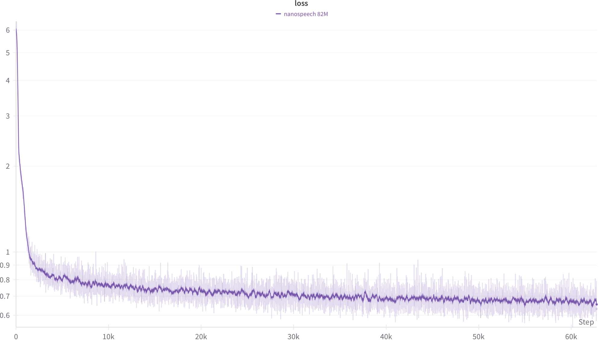
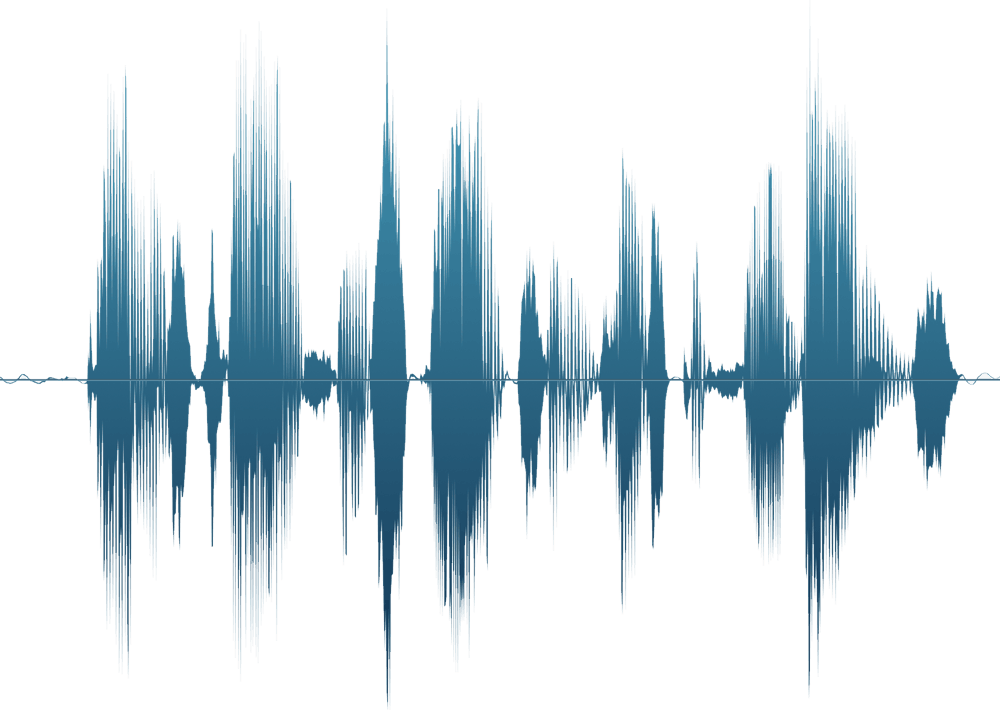

# Training a Text-to-Speech Model from Scratch

[Nanospeech](https://github.com/lucasnewman/nanospeech) is a simple, hackable text-to-speech system in PyTorch and MLX.

This guide will show you how to use Nanospeech and the LibriTTS-R dataset to train your own text-to-speech model from scratch.

## Requirements

- Python 3.10 or later
- ffmpeg for audio file conversion
- A node with a GPU that you can use for training with PyTorch

## Table of contents

1) [Preparing the dataset](#step-1-preparing-the-dataset)
2) [Training the speech generation model](#step-2-training-the-speech-generation-model)
3) [Training the duration prediction model](#step-3-training-the-duration-prediction-model)
4) [Generating speech](#step-4-generating-speech)
5) [Further experimentation ideas](#step-5-further-experimentation-ideas)

## Step 1: Preparing the dataset

LibriTTS-R is a dataset with paired speech and text transcriptions with around 580 hours of audio. The dataset is well-suited for text-to-speech experiments because it provides clean, high-quality audio sampled at 24kHz, with speech split along sentence breaks and each sample under 30 seconds.

Before training, we’ll process the original dataset into a WebDataset. This format allows us to stream samples directly from storage, reducing the need for extra downloads or preprocessing on the GPU node.

*Note: If you'd like to skip this step, there's a prepared dataset available on [Hugging Face](https://huggingface.co/datasets/lucasnewman/libritts-r-webdataset).*

### Downloading the clean splits

The first thing we need to do is to download the clean splits from the dataset on [OpenSLR](https://www.openslr.org/141/).

```sh
mkdir -p extracted &&
wget -q --show-progress https://www.openslr.org/resources/141/dev_clean.tar.gz \
    https://www.openslr.org/resources/141/train_clean_100.tar.gz \
    https://www.openslr.org/resources/141/train_clean_360.tar.gz &&
tar -xvf dev_clean.tar.gz -C extracted &&
tar -xvf train_clean_100.tar.gz -C extracted &&
tar -xvf train_clean_360.tar.gz -C extracted &&
rm dev_clean.tar.gz train_clean_100.tar.gz train_clean_360.tar.gz
```

### Preprocessing

Once we have the data, we’ll preprocess it by:

- Converting the audio into 64kbps MP3 files, which will make the dataset about 80% smaller with minimal quality loss.
- Converting the transcriptions and audio duration into a JSON metadata file.
- Creating .tar files containing the samples, split into shards of 1000 examples.
- Creating a vocabulary from each character in the transcriptions, so we can tokenize them.

###

First, let's create the vocabulary with a Python script:

```python
from pathlib import Path

dataset_dir = Path("extracted") / "LibriTTS_R"

vocab = set()
all_txt_files = sorted(list(dataset_dir.rglob("*.normalized.txt")))
for txt_path in all_txt_files:
    text = txt_path.read_text(encoding="utf-8").strip()
    for t in text:
        vocab.update(t)

with open("vocab.txt", "w", encoding="utf-8") as f:
    f.write('\n'.join(sorted(vocab)))
```

This will output a `vocab.txt` file that we'll use during training.

Next, we want to convert the .wav files to MP3s. Since converting the audio files sequentially is slow, we’ll speed it up using parallel processing with the following shell script:

```sh
% cat convert_to_mp3.sh
#!/bin/bash

INPUT_DIR="extracted/LibriTTS_R"

convert_file() {
  infile="$1"
  outfile="${infile%.wav}.mp3"
  ffmpeg -i $infile -ab 64k $outfile -y &>/dev/null
}

export -f convert_file

find "$INPUT_DIR" -type f -name "*.wav" | parallel -j "$(sysctl -n hw.ncpu)" convert_file

% chmod +x convert_to_mp3.sh
% ./convert_to_mp3.sh
```

We should now have both .wav and .mp3 files for each sample -- we'll only use the MP3 files when we create the dataset, but the .wav files will let us compute duration for each sample quickly from the file size on disk.

Let's use another Python script to construct the WebDataset shards:

```python
import io
import json
from pathlib import Path
import tarfile
from tqdm import tqdm

def process_sample(mp3_path: Path, txt_path: Path):
    text = txt_path.read_text(encoding="utf-8").strip()
    wav_path = mp3_path.with_suffix(".wav")
    try:
        wav_size = wav_path.stat().st_size
    except Exception as e:
        raise RuntimeError(f"Cannot access WAV file {wav_path}: {e}")

    # For 24kHz, 16-bit mono, each sample is 2 bytes;
    # bytes per second = 24000 * 2 = 48000. Subtract an approximate 44-byte header.
    header = 44
    if wav_size > header:
        duration = (wav_size - header) / 48000.0
    else:
        duration = 0.0
    meta = {"text": text, "duration": duration}
    meta_bytes = json.dumps(meta).encode("utf-8")
    key = mp3_path.stem
    return key, meta_bytes


def create_sharded_wds_tar(dataset_dir: Path, out_dir, shard_size):
    out_dir = Path(out_dir)
    out_dir.mkdir(parents=True, exist_ok=True)
    shard_index = 0
    current_shard = out_dir / f"shard-{shard_index:06d}.tar"
    tar_out = tarfile.open(current_shard, "w")
    sample_count = 0

    all_mp3_files = sorted(list(dataset_dir.rglob("*.mp3")))
    for mp3_path in tqdm(all_mp3_files, desc="Processing samples"):
        txt_path = mp3_path.with_suffix(".normalized.txt")
        if not txt_path.exists():
            continue
        try:
            key, meta_bytes = process_sample(mp3_path, txt_path)
        except Exception as e:
            print(f"Error processing {mp3_path}: {e}")
            continue

        tar_out.add(str(mp3_path), arcname=f"{key}.mp3")

        json_info = tarfile.TarInfo(name=f"{key}.json")
        json_info.size = len(meta_bytes)
        tar_out.addfile(json_info, io.BytesIO(meta_bytes))

        sample_count += 1
        if sample_count % shard_size == 0:
            tar_out.close()
            shard_index += 1
            current_shard = out_dir / f"shard-{shard_index:06d}.tar"
            tar_out = tarfile.open(current_shard, "w")

    tar_out.close()


# create the shards into the `shards` directory with 1000 examples in each shard

dataset_dir = Path("extracted") / "LibriTTS_R"

create_sharded_wds_tar(dataset_dir, "shards", 1000)
```

This should run relatively quickly as we avoid loading any audio files into memory. After it's finished, we'll have 155 .tar file shards containing the whole dataset — roughly 8GB for 158,000 examples.

Now that we've preprocessed the dataset, we can upload it to an hosting provider like Hugging Face or Amazon S3.

## Step 2: Training the speech generation model

Now that we have our dataset, we're ready to train the model. First, install Nanospeech and its dependencies on the GPU node:

```sh
pip install nanospeech
```

We'll also want to configure wandb for logging (if desired):

```sh
wandb login <wandb_token>
```

Let's set up Accelerate on the node for single-node GPU training. When prompted for precision, `bf16` is a good choice to balance numerical stability and performance on recent Nvidia GPUs.

```sh
accelerate config
```

We'll also need to make some choices about the size of our model, the hyperparameters used for training, and the amount of compute to use. Let's set up the training script in a file called `train.py`:

```python

from functools import partial
from torch.optim import AdamW
from datasets import load_dataset

from nanospeech.nanospeech_torch import (
    Nanospeech,
    DiT,
    list_str_to_vocab_tensor,
    SAMPLES_PER_SECOND
)
from nanospeech.trainer_torch import NanospeechTrainer


def train():
    # create our vocab-based tokenizer

    with open("vocab.txt", "r") as f:
        vocab = {v: i for i, v in enumerate(f.read().splitlines())}
    tokenizer = partial(list_str_to_vocab_tensor, vocab=vocab)
    text_num_embeds = len(vocab)

    # set up the model -- we'll use an 82M parameter model like the pretrained model

    model = Nanospeech(
        transformer=DiT(
            dim=512,
            depth=18,
            heads=12,
            text_dim=512,
            ff_mult=2,
            conv_layers=4,
            text_num_embeds=text_num_embeds,
        ),
        tokenizer=tokenizer,
    )

    print(f"Trainable parameters: {sum(p.numel() for p in model.parameters() if p.requires_grad):,}")

    # configure an optimizer -- we'll use AdamW as a baseline, but this could be any optimizer

    optimizer = AdamW(model.parameters(), lr=1e-4)

    # set up the trainer

    trainer = NanospeechTrainer(
        model,
        optimizer,
        num_warmup_steps=1000,
        accelerate_kwargs={
            "mixed_precision": "bf16",
            "log_with": "wandb",  # if you're using wandb logging
        },
    )

    # load the dataset we prepared in step 1

    dataset = load_dataset(
        "lucasnewman/libritts-r-webdataset",
        split="train",
        streaming=True  # configure the dataset for streaming for instant start
    )

    # configure the batch size based on available GPU memory (e.g. a GH200 in our case)

    batch_size = 112
    max_duration_sec = 10
    max_duration = int(max_duration_sec * SAMPLES_PER_SECOND)  # note: duration is expressed in audio frames
    max_batch_frames = int(batch_size * max_duration)

    # train for 1 million steps

    total_steps = 1_000_000

    trainer.train(
        dataset,
        total_steps,
        batch_size=batch_size,
        max_batch_frames=max_batch_frames,
        max_duration=max_duration,
        num_workers=8,
        save_step=10_000,  # save a checkpoint every 10k steps
    )

# start training

train()
```

Now we're ready to train the model — let's start it up:

```sh
accelerate launch train.py
```

After a short delay to load the dataset metadata and initial samples, we should start to see training progress. As it progresses, the loss should continue to decrease and we can see metrics in our wandb dashboard:



The training will take a few days to complete, so we'll just let it run until we reach 1M steps, and then save the final checkpoint.

## Step 3: Training the duration prediction model

The duration prediction model takes a reference speech sample and its transcription, along with the new text to be synthesized, and predicts the duration of the generated speech. We'll use the predicted duration as an input into the speech generation pipeline.

The training setup for the duration prediction model is very similar to the speech generation model, except that the output of the network is the predicted duration instead of a generated waveform.

Since the model predicts only a single value, it can be smaller and omit the timestep embeddings used in the speech generation model.

Let's write a python script to handle it in `train_duration.py`:

```python
from functools import partial
from torch.optim import AdamW
from datasets import load_dataset

from nanospeech.nanospeech_torch import (
    DurationPredictor,
    DurationTransformer,
    list_str_to_vocab_tensor,
    SAMPLES_PER_SECOND
)
from nanospeech.trainer_torch import DurationTrainer


def train():
    # using our same vocab-based tokenizer

    with open("vocab.txt", "r") as f:
        vocab = {v: i for i, v in enumerate(f.read().splitlines())}
    tokenizer = partial(list_str_to_vocab_tensor, vocab=vocab)
    text_num_embeds = len(vocab)

    # set up the model -- we'll use a shallower model since the objective is simpler

    model = DurationPredictor(
        transformer=DurationTransformer(
            dim=512,
            depth=8,
            heads=8,
            text_dim=512,
            ff_mult=2,
            conv_layers=4,
            text_num_embeds=text_num_embeds,
        ),
        tokenizer=tokenizer,
    )

    print(f"Trainable parameters: {sum(p.numel() for p in model.parameters() if p.requires_grad):,}")

    # configure an optimizer

    optimizer = AdamW(model.parameters(), lr=1e-4)

    # set up the trainer

    trainer = DurationTrainer(
        model,
        optimizer,
        num_warmup_steps=1000,
        accelerate_kwargs={
            "mixed_precision": "bf16",
            "log_with": "wandb",  # if you're using wandb logging
        },
    )

    # load the same dataset we prepared in step 1

    dataset = load_dataset(
        "lucasnewman/libritts-r-webdataset",
        split="train",
        streaming=True  # configure the dataset for streaming for instant start
    )

    # configure the batch size based on available GPU memory

    batch_size = 112
    max_duration_sec = 10
    max_duration = int(max_duration_sec * SAMPLES_PER_SECOND)
    max_batch_frames = int(batch_size * max_duration)

    # train for 250k steps

    total_steps = 250_000

    trainer.train(
        dataset,
        total_steps,
        batch_size=batch_size,
        max_batch_frames=max_batch_frames,
        max_duration=max_duration,
        num_workers=8,
        save_step=10_000,
    )

# start training

train()
```

Training the duration prediction model requires less compute than the speech generation model, so you may be able to use a larger batch size and fewer training steps.

Once we've finished training the duration prediction model, we're ready to generate speech — let's give it a shot.

## Step 4: Generating speech

To start generating speech, we'll take the three key pieces that we've produced and upload them to a Hugging Face model repository.

Nanospeech uses the [safetensors](https://huggingface.co/docs/safetensors/convert-weights) format for model storage, which is widely used and portable between machine learning frameworks like PyTorch and MLX.

After converting the model weights to the safetensors format, we'll upload these files:

- The speech generation model: `model.safetensors`
- The duration prediction model: `duration.safetensors`
- The vocabulary we created for tokenization: `vocab.txt`

See the [pretrained model repository](https://huggingface.co/lucasnewman/nanospeech/tree/main) on Hugging Face for an example.

Now we can invoke Nanospeech with our custom model:

```sh
python -m nanospeech.generate \
--model <hf_model_repo_id>
--text "I was trained from scratch in just a few days."
```

This should produce output similar to [this sample](https://s3.amazonaws.com/lucasnewman.datasets/nanospeech/tutorial/sample.wav) and visualizing the generated waveform will look similar to this:



## Step 5: Further experimentation ideas

The Nanospeech code is intentionally designed to be scalable and hackable, and there are many directions we could go from here, such as:

- Training on longer samples for better long-form generation

- Tuning hyperparameters for more effective training

- Training on much larger and/or multilingual datasets, like [Emilia](https://huggingface.co/datasets/amphion/Emilia-Dataset)

- Scaling to a larger model using [muP](https://github.com/microsoft/mup) to optimize hyperparameter transfer

- Experimenting with different choices of optimizers, e.g. Muon, ADOPT, or MARS

- Extending the dataset and model architecture to guide generation with e.g. emotional expression or non-verbal utterances

Share your ideas or ask questions in the [discussions](https://github.com/lucasnewman/nanospeech/discussions) section!
